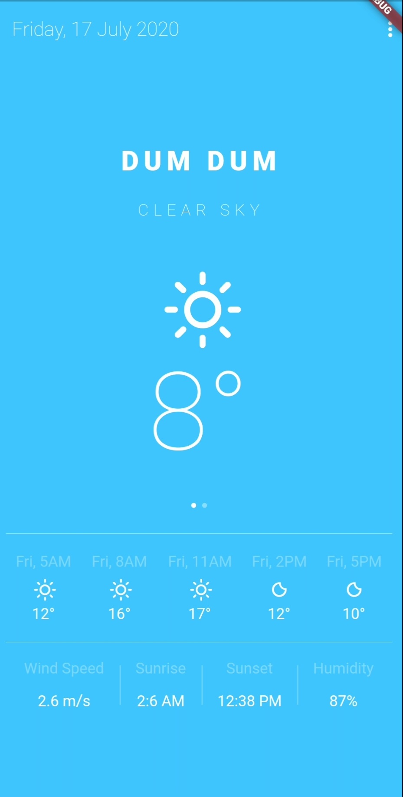
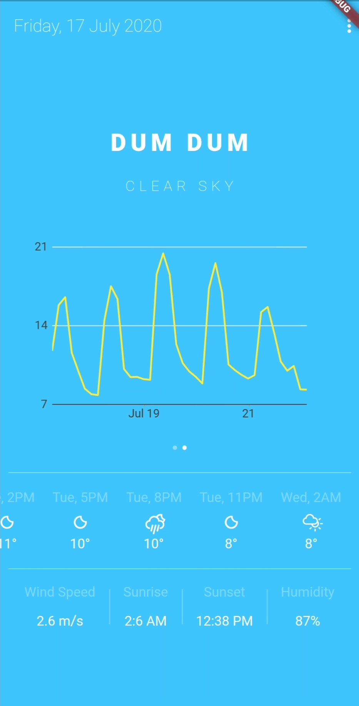
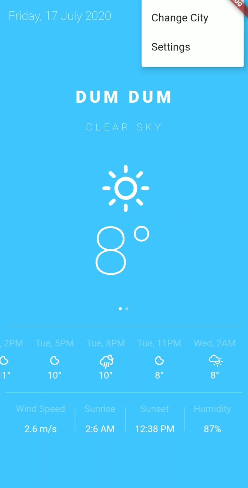
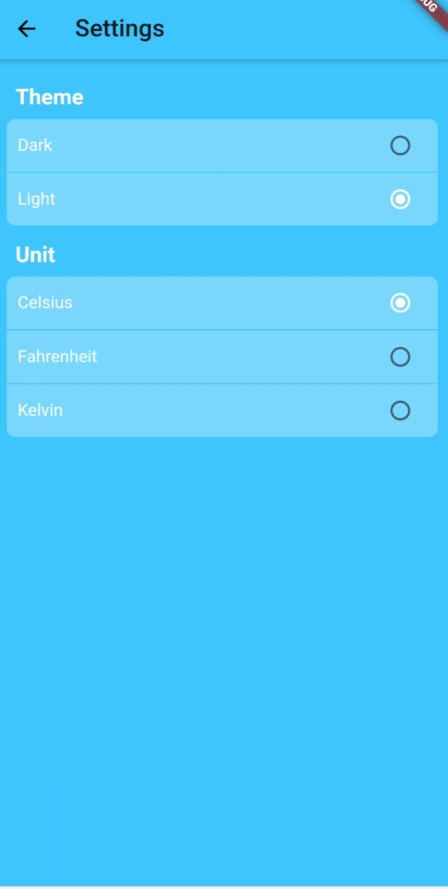

# Weather Watch

 
A Flutter cross platform application to view current weather status.

## Features

- :white_check_mark: Dark and Light themes
- :white_check_mark: Current temperature, sunset, sunrise, humidity etc 
- :white_check_mark: Custom icons for each weather condition
- :white_check_mark: Every 3 hours forecast
- :white_check_mark: BLoC pattern for API calls
- :white_check_mark: Line graph to show temperature variance

Tags: Flutter, Dart, Android Studio, openweatherAPI

<b> Screenshots</b>

 
 
 
 

